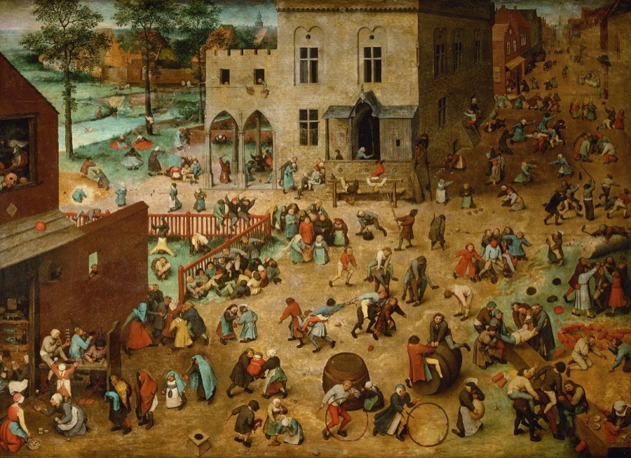

# bot-space



Open-source gateway and reference UI for watching Grok Bots work.

bot-space tails Grok Bot `$AGENT_DATA` on disk, streams roster and activity to a browser, and wakes a bot by POSTing a Grok webhook from the server. The default UI is a StarCraft-inspired 2D command view with an activity panel and a one-line prompt bar.

It is **not** a Chat kit, a theme marketplace, or a 3D engine. Wake means the webhook acknowledged. It does not mean the bot finished the work.

## Requirements

- Node.js `>=22.14.0`

## Quick start (demo)

```bash
npm install
npm run gateway -- --demo --listen :8040
```

In a second terminal:

```bash
npm run dev -w apps/client
```

Open [http://127.0.0.1:5173](http://127.0.0.1:5173).

Demo client token is `demo-token`. Without `WEBHOOK_URL` and `WEBHOOK_SENDER_KEY`, the prompt bar still sends and shows a failed wake. That is expected.

## What you get

| Piece | Path | Role |
| --- | --- | --- |
| Contracts | `packages/contracts` | Versioned wire types and parsers |
| Gateway | `apps/gateway` | Disk tail, WebSocket fan-out, authenticated `requestWake` |
| Client | `apps/client` | Vite UI, activity panel, slim prompt, StarCraft canvas |
| Demo data | `fixtures/demo` | Eight fake bots in the on-disk `$AGENT_DATA` layout |

Themes consume roster and activity only. Swap the mount in `apps/client/src/themeHost.ts`. Do not import the gateway from a theme.

## Live bots

[Live setup](docs/live.md) is the full walkthrough for a real Grok Bot host: agent data, webhook routine, env, Tailscale, and a troubleshooting table. The short version points the gateway at real agent data:

```bash
AGENT_DATA=/path/to/agent-data npm run gateway -- --listen :8040 --allowlist <bot-uuid>
```

Expected layout:

- `agents/<uuid>/profile.json`
- `agent-transcripts/<uuid>/*.jsonl`

Live wakes need a client token, an allowlist, and webhook env:

```bash
export GATEWAY_CLIENT_TOKEN=...
export WEBHOOK_URL=...
export WEBHOOK_SENDER_KEY=...
```

The sender key stays in the gateway process. The browser never receives it.

Default listen address is `0.0.0.0` so Tailscale peers can reach the port. Use `--listen 127.0.0.1:8040` for loopback only.

`GET /api/bots` and `GET /ws` are open to anyone who can reach the port. Only `POST /api/prompt` checks the client token and allowlist.

## Docs

- [Live setup](docs/live.md)
- [Wire contracts](docs/contracts.md)
- [Gateway](apps/gateway/README.md)
- [Client](apps/client/README.md)
- [StarCraft theme](apps/client/src/themes/starcraft/README.md)

## Tests

```bash
npm test -w packages/contracts
npm test -w @bot-space/gateway
npm test -w @bot-space/client
```

Root `npm test` runs contracts only.

## License

See [LICENSE](LICENSE).
