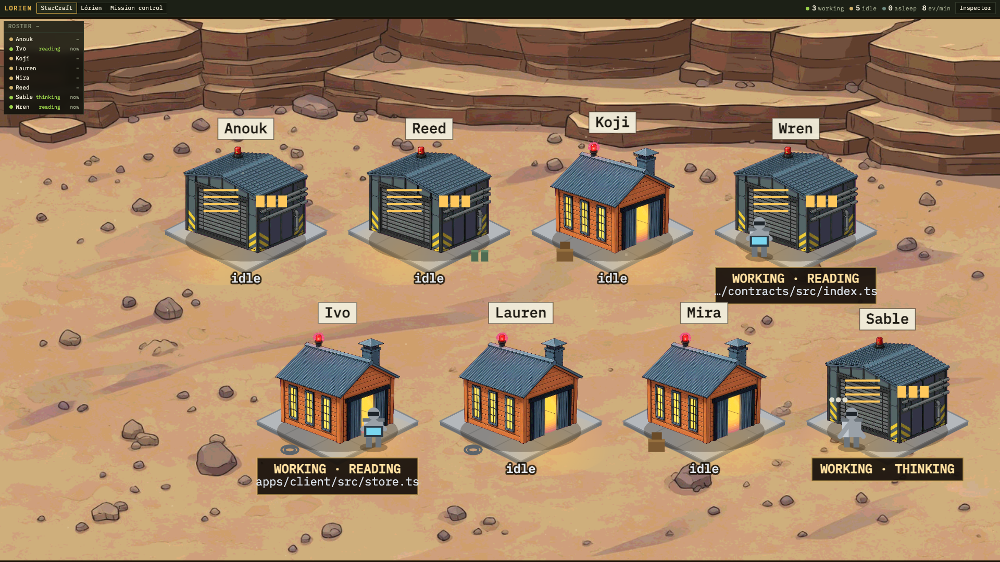
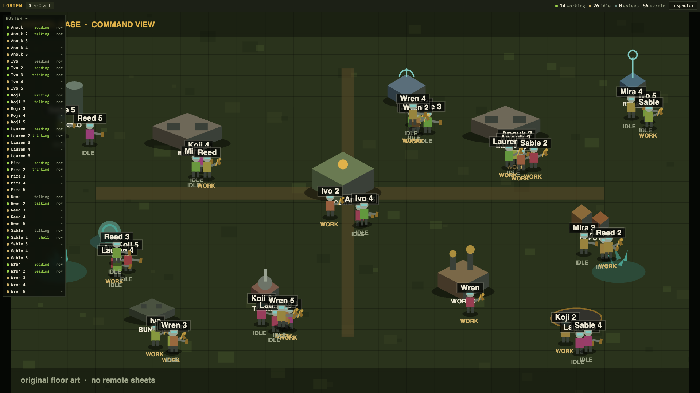
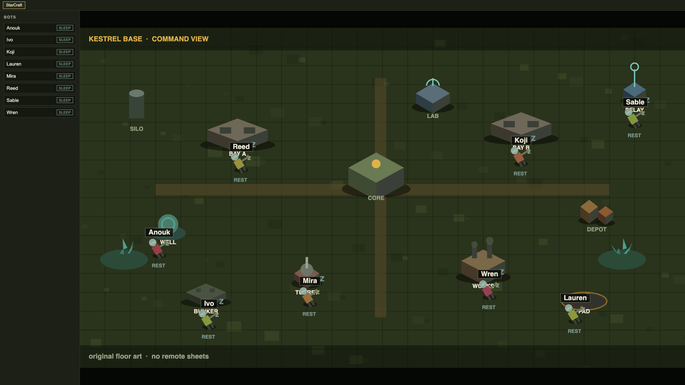
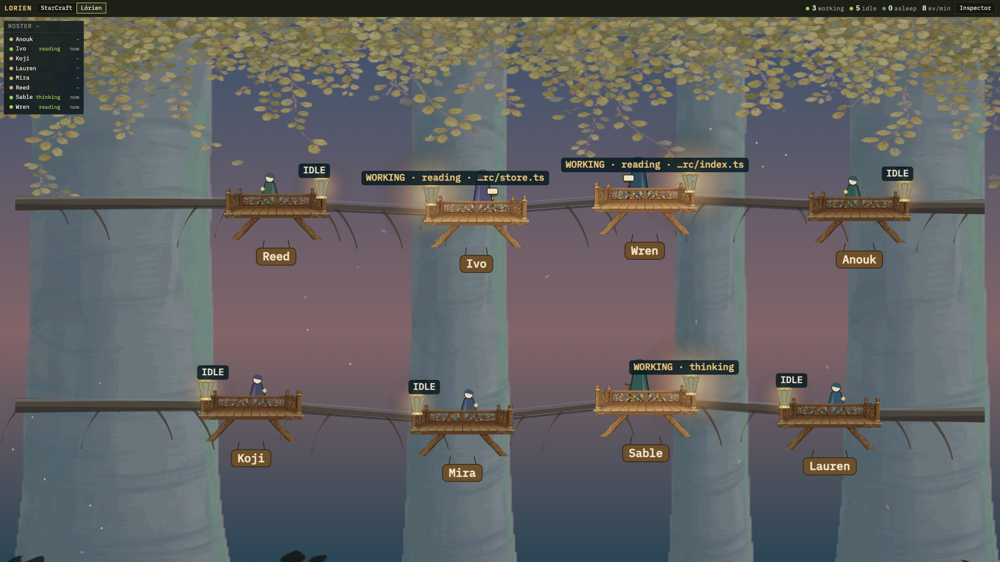
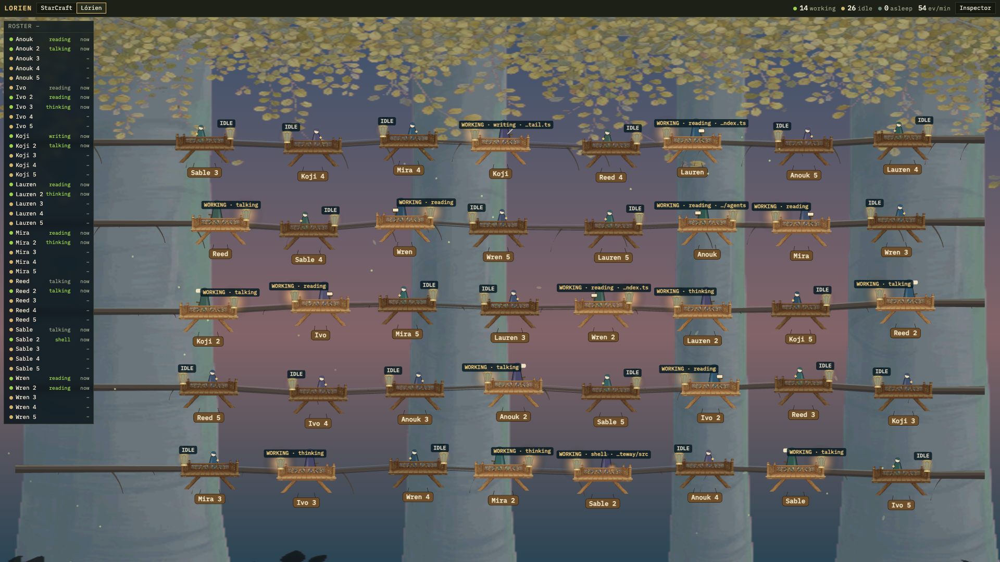
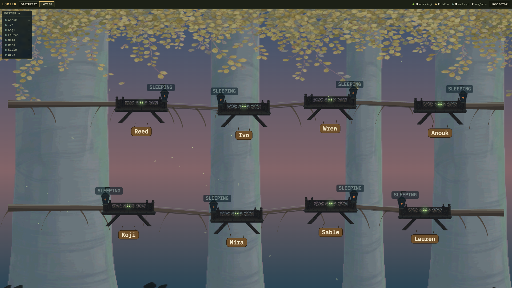
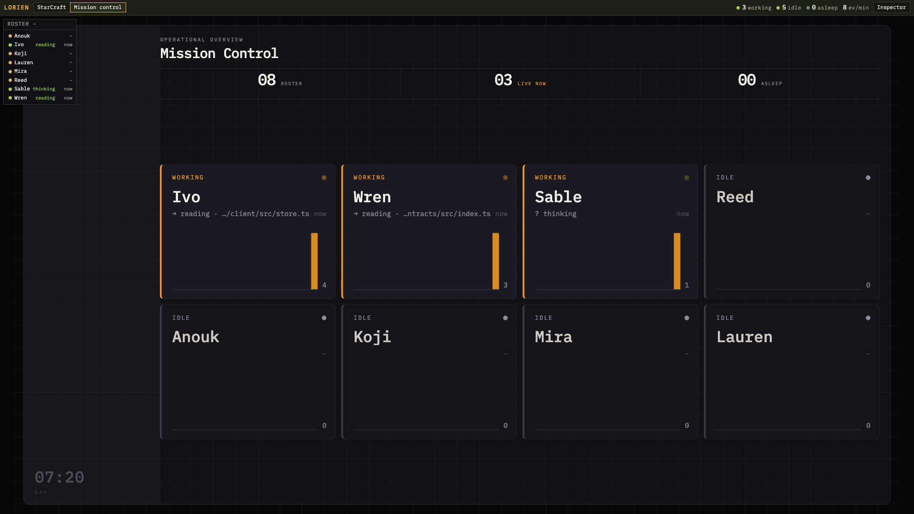
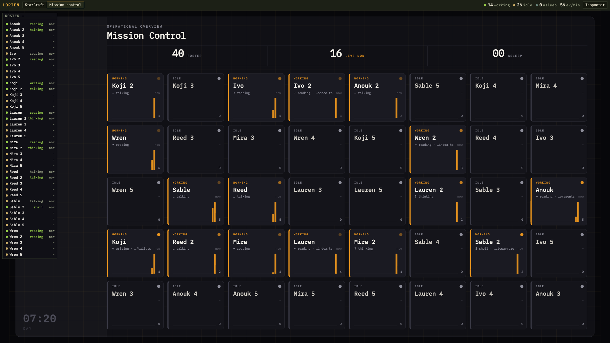
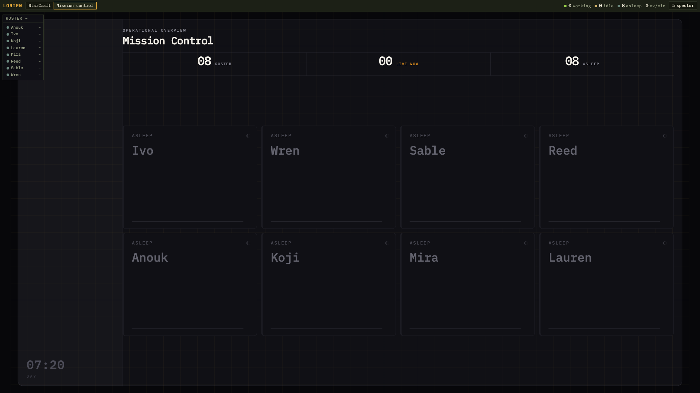

# Watch Grok Bots work


**Lorien Bot** visualizes the user's Grok Bots: roster and activity from a command view. It is a Grok Bot that installs and runs lorien-stack on the host, then helps keep that stack healthy.

**lorien-stack** is the core Lorien Bot runs under the hood. Gateway, contracts, and client stay here.

lorien-stack observes Grok Bots; it does not wake bots or provide chat.

The stack tails Grok Bot `$AGENT_DATA` on disk and streams roster, activity, and presence to a browser. The default theme is StarCraft, an isometric outpost. The header picker also mounts Lórien and Mission Control.

Three themes share one roster and activity feed. Sharing that feed is the theme seam. The stack is not a Chat kit, a theme marketplace, or a 3D engine.

## Themes

The [hosted demo](https://yuri-poliantsev.github.io/lorien-stack/) is the static client replaying bundled fixtures, with no gateway. Add `?theme=` or `?demo=` to that URL. They work together.

Each row is a still at 8 bots, a still at 40 bots, and a still of 8 bots asleep. The clip is 20 seconds at 16:9.

### StarCraft

StarCraft is the default theme. Each bot has one hut or vault on the canyon floor. A worker appears when the bot is active. Asleep is a dark building with one red beacon.

[Open StarCraft in the hosted demo](https://yuri-poliantsev.github.io/lorien-stack/?theme=starcraft)

| 8 bots | 40 bots | 8 asleep |
| --- | --- | --- |
|  |  |  |

[StarCraft 20-second clip](docs/images/themes/starcraft.mp4)

### Lórien

Lórien is a side view. A flet is a tree platform. One flet per bot sits on a mallorn trunk under a dusk canopy. Working elves stand at a rail. Asleep is a dark flet with a sleeping figure and green lanterns.

[Open Lórien in the hosted demo](https://yuri-poliantsev.github.io/lorien-stack/?theme=lorien)

| 8 bots | 40 bots | 8 asleep |
| --- | --- | --- |
|  |  |  |

[Lórien 20-second clip](docs/images/themes/lorien.mp4)

### Mission Control

Mission Control is an editorial dark dashboard. The board shows one card per bot. A status band shows roster, live, and asleep counts. Asleep cards go dim.

[Open Mission Control in the hosted demo](https://yuri-poliantsev.github.io/lorien-stack/?theme=mission-control)

| 8 bots | 40 bots | 8 asleep |
| --- | --- | --- |
|  |  |  |

[Mission Control 20-second clip](docs/images/themes/mission-control.mp4)

## Vision

One shared runtime for many looks. Keep discovery, activity, and presence stable. Let themes change freely.

Inspiration is one-shot generated villages that burn tokens to rebuild the whole app. Lorien Bot inverts that. The gateway and contracts stay in git inside lorien-stack. A theme is a consumer of roster and activity events, not a generated rewrite of the stack. 2D ships first. 3D stays possible later because spatial fields on the wire are optional, not because the core embeds a scene graph.

## Status

Shipped and exercised on real Grok Bot hosts.

- Contracts, gateway, Vite client, and three themes on `main` (StarCraft, Lórien, Mission Control)
- Demo mode with fixture bots and compressed replay
- Hosted demo on GitHub Pages, replaying bundled fixtures in the browser
- Live mode against `$AGENT_DATA`, including large transcript files
- Live presence hints from a quiet clock (heuristic, not lifecycle)
- OSS live how-to and a paste-ready [setup prompt](docs/prompts/lorien-stack-setup.md) for installing on a host
- Live start needs only a data root

Known limits.

- `GET /api/bots` and `GET /ws` are reachable by anyone who can open the port. The bind address plus the Tailscale ACL are the access control.
- Presence is a quiet-time hint. Long tool calls with no JSONL growth can look asleep
- No WebSocket reconnect. Reload the page after a gateway restart
- One disk layout (grok driver)

## Next steps

Three themes ship, so the theme seam is proven.

1. Fix friction from real runs. Reconnect, presence feel, and doc gaps beat new features.
2. Optional read-path auth for roster and `/ws` when the UI sits on a wide Tailscale ACL.
3. Publish Lorien Bot as a Grok Bot template per [Publish a Lorien Bot template](docs/prompts/lorien-bot-template.md). Confirm a freshly added copy can see `$AGENT_DATA` before a wide share.

## Requirements

- Node.js `>=22.14.0`

## Quick start (demo)

```bash
npm install
npm run gateway -- --demo --listen :8040
```

In a second terminal:

```bash
npm run dev -w apps/client
```

Open [http://127.0.0.1:5173](http://127.0.0.1:5173).

The demo copies fixtures to a temporary agent-data tree and replays transcript activity. It needs no extra env.

## What you get

This repo is lorien-stack, the core under Lorien Bot.

| Piece | Path | Role |
| --- | --- | --- |
| Contracts | `packages/contracts` | Versioned wire types and parsers |
| Gateway | `apps/gateway` | Disk tail, roster, presence, WebSocket fan-out |
| Client | `apps/client` | Vite UI, overlay roster, three themes (StarCraft default) |
| Demo data | `fixtures/demo` | Eight fake bots in the on-disk `$AGENT_DATA` layout |

Themes consume roster and activity only. Swap the mount in `apps/client/src/themeHost.ts`. Do not import the gateway from a theme.

## Live bots

[Live setup](docs/live.md) is the full walkthrough for a real Grok Bot host: agent data, env, Tailscale, and a troubleshooting table. [Setup prompt](docs/prompts/lorien-stack-setup.md) is the same walkthrough as one block you paste to a Grok Bot on that host. The short version points the gateway at real agent data:

```bash
export AGENT_DATA=/path/to/agent-data
npm run gateway -- --listen :8040
```

Expected layout:

- `agents/<uuid>/profile.json`
- `agent-transcripts/<uuid>/*.jsonl`

See `.env.example` for the template. Live boot reads `AGENT_DATA` only. `--data` overrides it.

Default listen address is `0.0.0.0` so Tailscale peers can reach the port. Use `--listen 127.0.0.1:8040` for loopback only.

`GET /api/bots` and `GET /ws` are open to anyone who can reach the port. Narrow the Tailscale ACL or bind to loopback when that is too broad.

## Docs

- [Live setup](docs/live.md)
- [Publish a Lorien Bot template](docs/prompts/lorien-bot-template.md)
- [Setup prompt](docs/prompts/lorien-stack-setup.md)
- [Wire contracts](docs/contracts.md)
- [Gateway](apps/gateway/README.md)
- [Client](apps/client/README.md)
- [StarCraft theme](apps/client/src/themes/starcraft/README.md)

## Tests

```bash
npm test -w packages/contracts
npm test -w @lorien-stack/gateway
npm test -w @lorien-stack/client
```

Root `npm test` runs contracts only.

## License

See [LICENSE](LICENSE).
